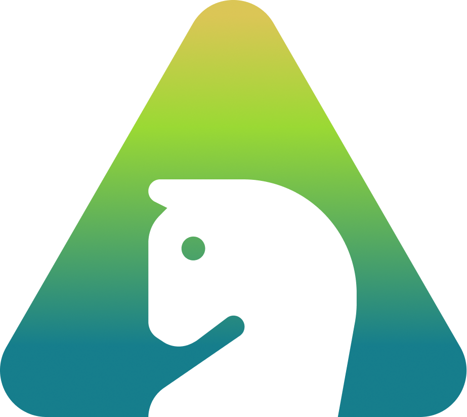

 
  
  <h2 align="center">Chess-Play</h2>

  

Revolutionizing Chess with Blockchain: Stake XTZ, Win NFTs      
    <a href="https://youtu.be/W3HBMstAKuA">View Demo</a>
    ·
    <a href="https://github.com/InfoNex-Labs/Proposal/issues">Request Feature</a>
    ·
    <a href="https://www.canva.com/design/DAF6wySXVK4/WkU2_Hli_bZDTzsby4tvlg/view?utm_content=DAF6wySXVK4&utm_campaign=designshare&utm_medium=link&utm_source=editor">Report Bug</a>
  

- [About The Project](#about-the-project)
- [Inspiration](#inspiration)
- [Game Architecture](#game-architecture)
- [Game Features](#features)
- [Game Demo](#game-demo)
- [Run Locally](#run-locally)
  - [Frontend](#frontend)
  - [Backend](#backend)
  - [Smart Contract](#smart-contract)
- [Future Work](#future-work)
- [Contact](#contact)
- [Acknowledgment](#acknowledgment)
- [Links and references](#links-and-references)

---

## About The Project
✨ Chess Play is an online platform merging chess with blockchain technology. Users can stake XTZ tokens to challenge friends, with the winner taking the entire prize and receiving a unique NFT showcasing their moves.

✨ These NFTs can gain significant value, especially with famous moves or tournament wins, potentially attracting new users and adding value to the Etherlink and Tezos communities.

✨ Technical features include creating matches, staking tokens, inviting opponents, and real-time gameplay with WebSocket communication, with NFTs minted on the Etherlink blockchain to store match details and history.

---
## Inspiration

Our inspiration for this project stems from the immense popularity of chess, as evidenced by Chess.com's staggering statistics: over 280 million visits per month, with 250,000 new accounts daily and 10 million games played daily. Notably, in 2022, a social media post featuring Lionel Messi and Cristiano Ronaldo playing chess went viral, further highlighting the game's widespread appeal. With Chess.com reaching a record seven million active members in a single day on December 31, 2022, it's evident that there's a significant demand for online chess platforms.

However, while the interest in chess is undeniable, there's a lack of web3 or blockchain-based alternatives for playable chess games. Our platform aims to fill this gap by offering a unique twist on traditional chess. By integrating **XTZ token staking** functionality and rewarding winners with NFTs that immortalize their special moves and tricks on the blockchain, we provide users with a novel and engaging experience.

Choosing Etherlink as our blockchain platform was deliberate. **Etherlink** offers exceptional security, network performance, and cost-effective transactions, with transaction fees as low as $0.01. Blocks are produced every 500 milliseconds, ensuring swift transaction confirmations within 0.5 to 1 second. Leveraging the decentralized nature, speed, and security of the **Tezos blockchain**, our platform aims to attract ***millions of users*** to the web3 ecosystem, contributing to the growth of the **Tezos and Etherlink communities**.
***

## Game Architecture

## Features

- **Match Creation and XTZ Staking:** Users can easily create chess matches on the platform and stake XTZ tokens to challenge opponents, adding an exciting layer of competitiveness to the gameplay.

- **Invite Opponents with Match IDs:** Invite friends or other players to join matches using unique match IDs.

- **Real-Time Gameplay with WebSocket Communication:** Experience chess matches in real-time through WebSocket communication, allowing for instant moves and reactions, enhancing the overall gaming experience.

- **Winner-Takes-All and Unique NFT Rewards:** The winner of each match takes the entire staked amount, incentivizing strategic gameplay. Additionally, the victor receives a unique NFT (Non-Fungible Token) that immortalizes their winning moves and achievements on the blockchain, adding prestige and value to their gaming prowess.

- **Storage on the Etherlink Rollup in Tezos Blockchain:** Game details, match history, and NFTs are securely stored on the Etherlink Rollup within the Tezos Blockchain, ensuring data integrity, transparency, and immutability. This integration with blockchain technology enhances the platform's trustworthiness and provides users with a decentralized gaming experience.

## Game Demo

---
## Run Locally

> [!NOTE]  
> Before running and testing the repository locally, please ensure that all the environmental variables are added (there are quite a few of them). 
> Also, consider configuring the port and Mongoose.

### Frontend
- Poit Terminal to `frontend` directory.
- Install dependencies using `npm install`.
- Run the nextjs development server `npm run dev`.

### Backend
- Poit Terminal to `backend` directory.
- Install dependencies using `npm install`.
- Run the backend server using `npm start`.

### Smart Contract
- Poit Terminal to `smart contract` directory.
- Install dependencies using `npm install`.
- Use `npx hardhat test` to run the integration tests.

---
## Future Work 
- In the pipeline, Chess Chain is set to expand with new functionalities. We're envisioning a robust marketplace where users can trade their NFTs, adding depth to the gaming experience.

- Additionally, we're committed to elevating user engagement through features like leaderboards, social interactions, and customizable profiles. These enhancements aim to make the Chess Chain experience even more immersive and enjoyable.

- Our overarching objective is to cultivate a vibrant community around Chess Play, positioning it as the premier destination for blockchain-powered chess gaming.

---

## Contact
Twitter - @Krieger Mail - prsumit35@gmail.com

Twitter - @sayantanGain07 Mail - bongsyantan007@gmail.com

Project github: https://github.com/SayantanBong007/Chess_Play

---

## Acknowledgment

Thanks to all the sponsors (Etherlink) and organizers (Encode-Club) for making Scaling Web3
Hackathon possible. We would really appreciate the feedback/guidance from the judges.

---

## Links and references
- Deployed Contract on Etherlink: [Etherlink-explorer](https://testnet-explorer.etherlink.com/address/0x8Fa642A1c807b71CBe6F73dA1343e090A4E18B1d)
- Figma File's: [Figma](https://www.figma.com/file/glPqL1ZHLqNwPauBKnm7Kw/Untitled?type=design&node-id=0-1&t=VFufaBNNwZgKHQ5y-0)